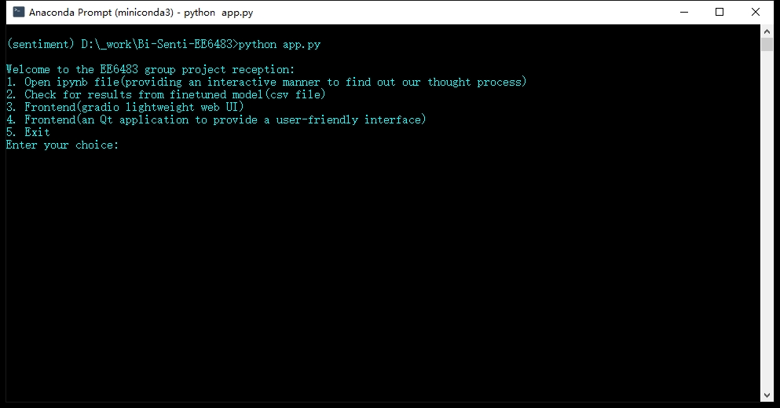
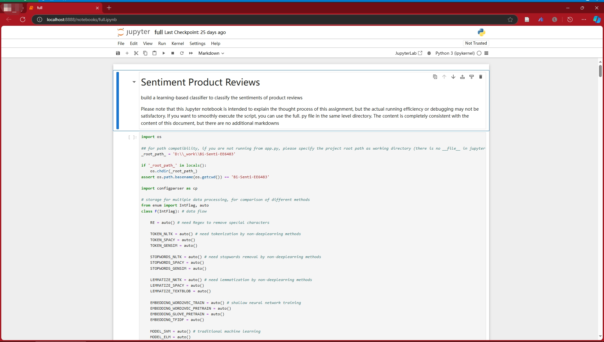
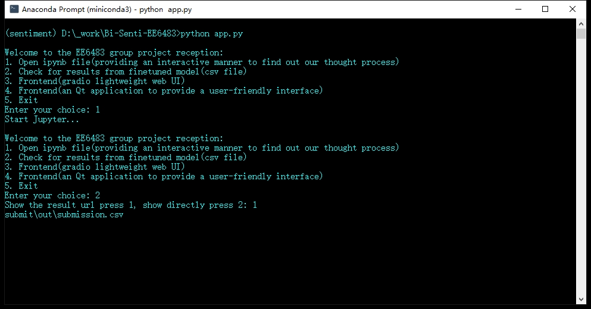
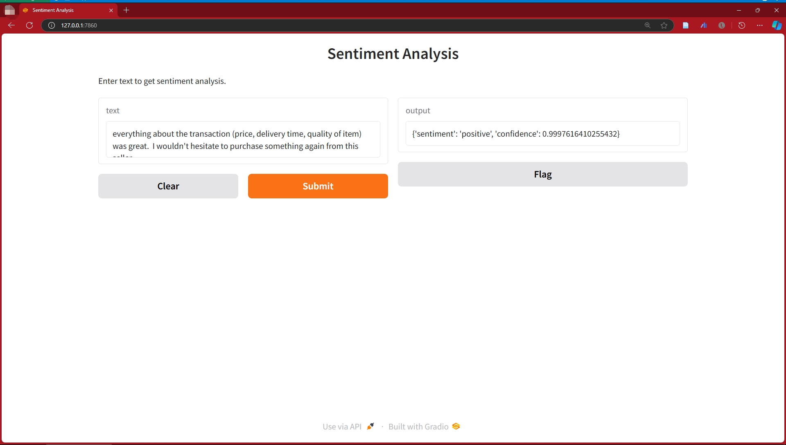
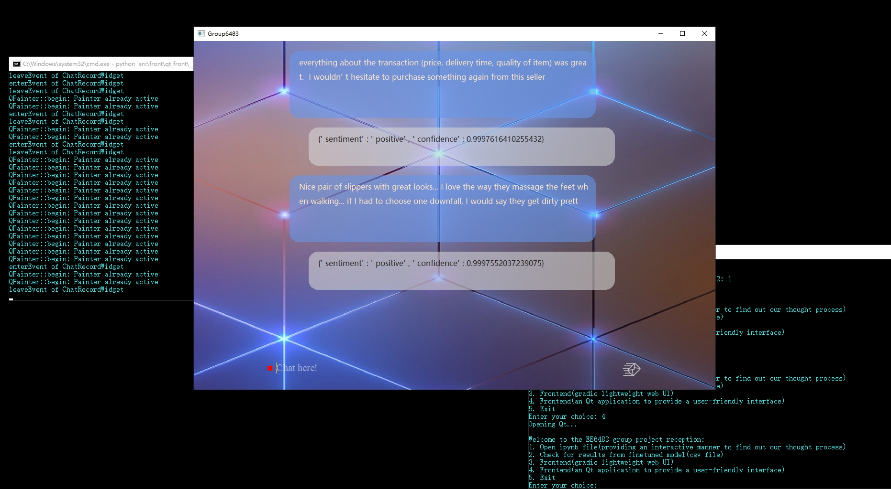

<h1 align="center">
  <br/>Bi-Senti-EE6483
</h1>

<h4 align="center">
  Yang Kaiwen, Li Siqi, Zheng Zhikai
</h4>

<h4 align="center">
  This is the assignment for EE6483 Binary Sentiment Analysis
</h4>

<div align="center">
  <a href="https://github.com/KuRRe8/Bi-Senti-EE6483"></a>
  <a href="https://www.python.org/"></a>
  <a href="https://github.com/KuRRe8/Bi-Senti-EE6483"></a>
  <a href="https://github.com/KuRRe8/Bi-Senti-EE6483"></a>
</div>

<div align="center">
    <a href="#introduction"><b>introduction</b></a> |
    <a href="#file-description"><b>File description</b></a> |
    <a href="#usage"><b>usage</b></a> |
    <a href="#discussion"><b>discussion</b></a> |
    <a href="#code-of-conduct"><b>code of conduct</b></a> |
    <a href="#demos"><b>demos</b></a>
</div>

## Introduction

Although this project is just an assignment for a master’s course, we aim to make it a reusable, ready-to-use, and standards-compliant program, rather than just one-time-use code. The main workflows in this repository come in two forms: an interactive Jupyter Notebook mode and a front-end mode based on Gradio and Qt. For the graphical interface, you only need to install the necessary libraries, with no additional configuration required to load the fine-tuned models from the checkpoint folder for real-time inference. For the Jupyter Notebook, detailed markdown and comments are also provided for guidance.

## File description

- [x] [task](/task/)-->EE6483 Group Task Documents
- [x] [contributor](/CONTRIBUTORS.md)-->List of contributors
- [x] [literature](/literature/)-->Collection of literature
- [x] [src](/src/)-->Source code
- [x] [data](/data/)-->Training and testing data
- [x] [config](/config/)-->Configuration files
- [x] [submit](/submit/)-->Submission files
- [x] [README](/README.md)-->Readme file
- [x] [checkpoint](/checkpoint/)-->Model checkpoints
- [x] [temp*](/temp/)-->Temporary files
  
## usage

In your conda distribution(anaconda/ miniconda/ miniforge):

```cmd
> conda activate <env_name>
> pip install -r ./config/requirements.txt 
# alternatively, you can use 
> conda install --file ./config/requirements.txt
```

**Be note that you'd better run in this way, to avoid path issues in the code, this is the reception of repo:**

```cmd
> python app.py
```

press <kbd>CTRL</kbd> + <kbd>C</kbd> to stop the program

## discussion

please refer to <https://github.com/KuRRe8/Bi-Senti-EE6483/discussions> for further discussion, kindly note that issues is not available for this repository.

## code of conduct

Do not push -f

Rebase or squash if you like

## demos

here is some demo pics for the usage of this project:

after entered the ```python app.py``` command, you will see the following interface:



then you can input corresponding choice.

### choice 1

open the jupyter notebook to experience the whole process of sentiment analysis, including data preprocessing, model training, model evaluation, and model prediction.



user should firstly modify this line ```_root_path_ = 'D:\\_work\\Bi-Senti-EE6483'``` to the root path of project on your local machine.

> **The entire code is segmented based on different functionalities (preprocessing, word embedding, training), rather than segmentation based on the model. The advantage of this approach is that we can freely specify the methods to be used in different stages, achieving high flexibility, and also testing my profound insights into common method process data (especially data shapes)**

then, at around line 50, you will find a code like this:

```python
#****************************************************************************************************
# USER DEFINED HERE
taskflows:list[F] = [
    F.ENSEMBLE_DISTILBERT,
    F.preset2,
    F.preset1,
]
#****************************************************************************************************
```

this is the defination of taskflows. you can combine different substeps together to form a new taskflow. You can add new rows for addtional tasks. All of these task will execute in order.

here I already provided 3 task demo. It covers the traditional NLP routines by sci-kit learn and deep learning routines by Pytorch/ Huggingface.

If you just want inference, you can either choose F.ENSEMBLE_DISTILBERT or other finetuned models as long as the model already exists in the checkpoint folder. Please note that I do not upload the checkpoint on Github. If you have a need of that, please notify me on the discussion panel.

### choice 2

choice 2 will give you the file path of our final result csv.



### choice 3

choice 3 will start gradio interface for real-time inference.



### choice 4

choice 4 is the Qt frontend. Please note that this needs Pyside2 installed.


